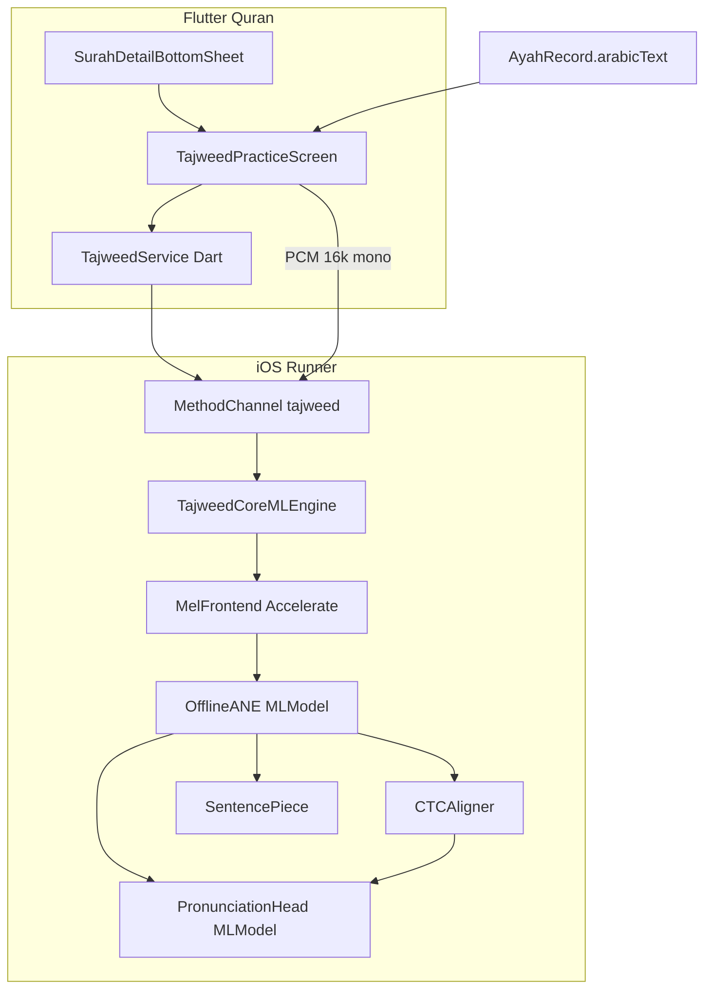

# iOS CoreML Tajweed Integration Plan

> Copied into `memory/` on 2026-07-28 from a plan drafted in Cursor's Plan
> mode (originally `~/.cursor/plans/ios_coreml_tajweed_f773627c.plan.md`), so
> it survives session resets and isn't tied to one user's machine. Treat this
> as the living plan — update it in place as phases complete, don't fork a
> second copy.

## Goal

Give Quran Reader users a **fully on-device** practice loop: pick an ayah →
record → get ASR + mispronunciation feedback, with no network at inference
time. Same model family as the lab
([`Muno459/fastconformer-quran`](https://huggingface.co/Muno459/fastconformer-quran)).

## Locked decisions (no ambiguity)

| Decision | Choice | Why |
| --- | --- | --- |
| Model | Same FastConformer-Quran family | Already validated in lab |
| CoreML source | **Ship upstream `.mlpackage`s**, do not DIY ONNX→CoreML for v1 | ANE needs windowed attention + pos-enc clamp; naive conversion fails (empty basmala) |
| Product mode v1 | **Record-then-score** | Matches lab UX; highest accuracy; simpler audio session |
| Device package | `fastconformer-quran-coreml-offline` **ANE** variant + **matched** pronunciation head | Real-time on Neural Engine; ~6% WER held-out |
| Live streaming | Deferred to v2 | Separate package + cache state machine |
| Bridge | New `MethodChannel` in [`ios/Runner/AppDelegate.swift`](../../../ios/Runner/AppDelegate.swift) | Same pattern as qibla/focus |
| UI entry | From [`SurahDetailBottomSheet`](../../../lib/features/quran/view/surah_detail_bottom_sheet.dart) | Surah header CTA + per-ayah mic action |
| Assets | First-use download into app sandbox, then offline forever | ~200MB+ would bloat IPA if bundled |
| Rules engine v1 | Swift port of alignment + head scoring + **word/token highlights**; full 27-rule text later | Ship correction UX first |



---

## Phase A — Contract lock (lab as source of truth)

Before writing Swift, freeze the on-device contract in [`tajweed-lab/`](../../../tajweed-lab/).

1. Accept HF access and download into `tajweed-lab/models/coreml/`:
   - [`Muno459/fastconformer-quran-coreml-offline`](https://huggingface.co/Muno459/fastconformer-quran-coreml-offline) (prefer `*-offline-ane.mlpackage`)
   - Matched `pronunciation-head.mlpackage`
   - `tokenizer.model` / `tokens.txt`
2. Document exact I/O in a new ADR + `docs/COREML_CONTRACT.md`:
   - Multifunction names `predict_T80` … `predict_T4800` (0.8s–48s)
   - Input `(1, 80, T)` mel → `logprobs (1, T/8, 1025)` + `encoder_output`
   - Blank id **1024**, frame hop **80 ms**
   - Head: pooled 512-d + token id → `prob_correct`
3. **Golden vectors**: for demos `01_alafasy_fatihah`, `02_basfar_ikhlas`, Basmala (1:1):
   - Save mel tensor, greedy transcript, first/last encoder frame checksums from Python/CoreML (or ONNX reference if CoreML Python runner unavailable on Mac)
   - Swift must match transcripts on these clips before UI work
4. **Mel parity gate** (critical edge case): validate pre-emphasis / log-ε / CMVN against the **CoreML package README**, not assume lab ONNX mel is identical. Lab currently uses pre-emphasis `0.97` in [`tajweed-lab/web/asr/mel.py`](../../../tajweed-lab/web/asr/mel.py); NeMo configs sometimes differ — **CoreML package wins**.

Exit criteria: three golden clips transcribe correctly under the documented contract.

---

## Phase B — Native Swift inference engine

New folder under Runner, e.g. `ios/Runner/Tajweed/`:

| Module | Responsibility |
| --- | --- |
| `MelFrontend.swift` | 16 kHz mono, 25 ms Hann / 10 ms hop, 512 FFT, 80 Slaney mels, `log(mel+ε)`, per-bin mean/var — Accelerate/vDSP |
| `CtcDecoder.swift` | Argmax → drop blank 1024 → collapse repeats |
| `SentencePieceTokenizer.swift` | Load `tokenizer.model` (vendor SP or small C++/ObjC wrapper) |
| `OfflineAsrModel.swift` | Load `.mlpackage`, pick `predict_T*` by padded length, `MLComputeUnits.cpuAndNeuralEngine` |
| `CtcAligner.swift` | Forced align expected tokens to frames (port of [`vendor/tajweed/aligner.py`](../../../tajweed-lab/vendor/tajweed/aligner.py) essentials) |
| `PronunciationHeadModel.swift` | Mean-pool encoder over intervals → head → probs |
| `TajweedEngine.swift` | Orchestrates: PCM → mel → ASR → decode → align vs expected → head scores → JSON report |
| `ModelStore.swift` | Download, verify SHA256, store under Application Support, atomic swap |

### CoreML length / function selection (edge cases)

- Pad mel time `T` up to nearest supported bucket (`T80`…`T4800`).
- Reject / split audio **> ~48 s** with a clear Flutter error (`ayah_too_long`); for multi-ayah practice later, chunk by ayah.
- Never load a DIY full-attention fp16 model on ANE (known **empty transcript** on Basmala).
- Always pair **offline encoder ↔ offline head** (never streaming head).

### Audio capture contract

- Flutter or Swift records **PCM 16-bit or float32, 16 kHz, mono**.
- Prefer native `AVAudioEngine` tap in Swift (less format chaos than browser webm — see `memory/technical-debt.md` TD-002).
- Configure `AVAudioSession` category `.playAndRecord` with `.defaultToSpeaker`, deactivate playback from `just_audio` **before** record (pause/stop in Dart).

### Report schema (channel result)

```json
{
  "ref": "1:4",
  "expected": "…",
  "hypothesis": "…",
  "durationSec": 4.68,
  "wordAccuracy": 1.0,
  "exactMatch": true,
  "tokens": [
    {"text": "…", "status": "ok|minor|major|miss|extra", "prob": 0.92, "startSec": 0.1, "endSec": 0.4}
  ]
}
```

Statuses: lexical miss/extra from alignment; `minor`/`major` from head thresholds (align with lab: major < 0.5, minor 0.5–0.85, ok ≥ 0.85).

---

## Phase C — Flutter ↔ iOS bridge

1. Channel name: `com.app.deenly.deenly/tajweed` (consistent with existing `com.app.deenly.deenly/*`).
2. Register in [`AppDelegate.swift`](../../../ios/Runner/AppDelegate.swift) beside focus/qibla handlers.
3. Dart: `lib/core/services/tajweed_service.dart` + feature folder `lib/features/tajweed/`.

Methods:

| Method | Args | Behavior |
| --- | --- | --- |
| `isAvailable` | — | iOS only; model on disk? |
| `ensureModel` | — | Download/progress stream via EventChannel |
| `prepare` | — | Warm-load MLModels (background) |
| `scoreAyah` | `surah`, `ayah`, `expectedArabic`, `pcmPath` or bytes | Full pipeline |
| `cancel` | — | Abort in-flight inference |

Android: return `unsupported` cleanly (no crash); Android CoreML N/A — future ONNX/TFLite out of scope for this plan.

### Permissions (must fix)

- Update [`ios/Runner/Info.plist`](../../../ios/Runner/Info.plist) `NSMicrophoneUsageDescription` to real tajweed copy.
- Add `PERMISSION_MICROPHONE=1` in [`ios/Podfile`](../../../ios/Podfile) `post_install` GCC_PREPROCESSOR_DEFINITIONS (today only location/notifications).
- Extend [`PermissionService`](../../../lib/core/services/permission_service.dart) with mic request helper.
- Android: add `RECORD_AUDIO` only if/when Android path exists (not v1).

---

## Phase D — Quran section UX integration

Attach only inside Quran detail (not the surah list).

**Entry points** in [`surah_detail_bottom_sheet.dart`](../../../lib/features/quran/view/surah_detail_bottom_sheet.dart):

1. **Header** — secondary button under Play Surah (~line 489): "Practice Tajweed" → opens practice for ayah 1 (or last-read).
2. **Per-ayah row** — mic icon beside each `AyahRecord` (do **not** overload existing tap-to-play).

**New screen** `TajweedPracticeScreen`:

- Shows expected Arabic (+ English) from `AyahRecord`
- Surah/ayah steppers (reuse repo data)
- Record / Stop / Retry
- Results: expected vs heard token chips (same semantics as lab web UI)
- Model download gate with progress on first open
- Pause/stop `AudioPlayer` on enter / before record

Navigation: `Navigator.push` from detail (matches current imperative style — see `memory/technical-debt.md` TD-003; no go_router change required).

Localization: add strings to existing l10n ARB files for EN/AR at minimum.

---

## Phase E — Edge-case matrix (must pass before ship)

| Case | Handling |
| --- | --- |
| Mic denied | Soft UI → Settings; no crash |
| Empty / too-short audio (<0.3s) | Reject with message |
| Too long (>48s) | Reject or auto-trim with warning |
| Silence / noise only | Empty/low-confidence hypothesis → "couldn't hear clearly" |
| Wrong ayah recited | Low word accuracy + red tokens; never crash |
| Partial ayah | Show misses for trailing expected words |
| Extra basmala before ayah | `extra` tokens; optional strip basmala heuristic later |
| Diacritic / alef variants | Compare diacritic-insensitive for match %; display fully diacritized hyp |
| Uthmani vs imlaei orthography | Prefer `quran_paak.json` text as expected (same as app); document known glyph diffs |
| Background / interruption | End recording on `AVAudioSession` interruption |
| Playback + record conflict | Always stop `just_audio` first |
| Low memory / model unload | Lazy load; release on memory warning; re-`prepare` |
| Corrupt download | SHA fail → delete + retry |
| Airplane mode after cache | Inference works; download UI only when missing |
| Simulator | CPU path may work; document ANE-only quirks for device QA |
| Hafs-only | UX caption: Hafs 'an Asim |
| Concurrent score calls | Single-flight lock in engine |
| App background mid-inference | Cancel or finish; don't block UI isolate forever |
| Very short ayahs (Kawthar) / long ayahs (2:282) | Short OK; 2:282 may exceed 48s → split guidance or streaming later |

---

## Phase F — QA & rollout

1. **Device QA set**: Fatihah 1:1–1:7, Ikhlas, Falaq, Nas, Baqarah 2:1–2:5, one long Madani ayah.
2. Instruments: Neural Engine residency, peak memory, score latency p50/p95.
3. Parity: same wav through lab ONNX vs on-device CoreML → transcript agree (diacritic-insensitive).
4. Feature flag / remote kill-switch optional via existing prefs.
5. Attribution string in practice screen footer (model credit).

---

## Suggested delivery order

1. **A** Contract + CoreML download into lab + golden tests
2. **B** Swift engine + CLI/host test harness in Runner (no Flutter UI yet)
3. **C** MethodChannel + Dart service + mic permissions
4. **D** Quran Practice UI wired to real scoring
5. **E–F** Edge-case QA on physical iPhone

## Out of scope for this plan

- Android inference
- Live streaming CoreML
- DIY ONNX→CoreML conversion (fallback only if upstream packages unblockable)
- Fine-tuning / re-training
- License/monetization policy — tracked separately in `memory/known-risks.md` RISK-001 and `tajweed-lab/decisions/ADR-005-license-npl.md`

## Progress

- [ ] Phase A — contract lock
- [ ] Phase B — Swift inference engine
- [ ] Phase C — Flutter ↔ iOS bridge
- [ ] Phase D — Quran section UX integration
- [ ] Phase E — edge-case QA
- [ ] Phase F — rollout

None started yet as of 2026-07-28 — see `memory/current-state.md` for the
literal next action.
