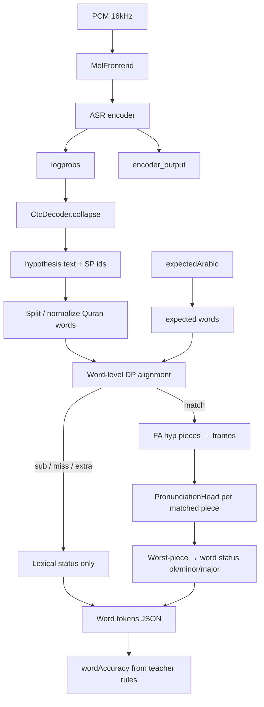
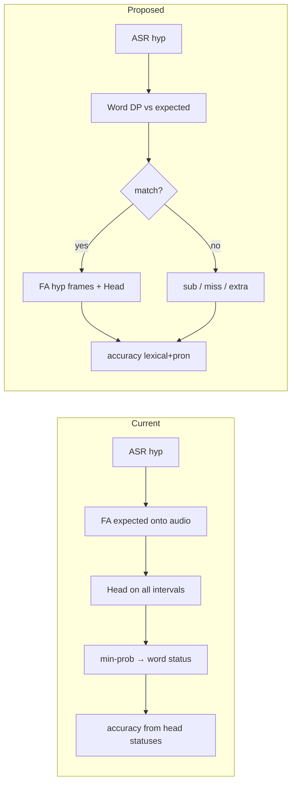

# Design: Lexical-first Tajweed scoring (teacher-like)

> **Status:** Implemented 2026-07-30 (ADR-006 revised).  
> **Date:** 2026-07-30  
> **Feature:** tajweed  
> **Depends on:** ADR-006 (score JSON), investigation
> [`android-ios-scoring-investigation-2026-07-30.md`](./android-ios-scoring-investigation-2026-07-30.md)

## 1. Problem (confirmed)

Wrong-ayah recitations still score ~75–100% because today’s engine:

1. Runs ASR → correct `hypothesis` (verified).
2. **Forced-aligns the expected ayah** onto the audio (always succeeds).
3. Runs the pronunciation head on those forced intervals.
4. Builds `wordAccuracy` from head statuses only.

Lexical identity is never the gate. The head is a GOP (goodness-of-pronunciation) model and does not reject wrong content.

**Clarification on “reference iOS”:** Production Swift (`TajweedEngine.swift`) currently mirrors Android’s forced-align-first path. There is no separate working iOS scoring baseline that already implements lexical-first behavior. This design is the *teacher-like* target for **both** platforms under ADR-006, not “copy current iOS.”

---

## 2. Answers (with codebase evidence)

### Q1 — Can the existing pronunciation head be reused unchanged?

**Yes, as a model/runtime.** Do not retrain or re-export for v1 of this architecture.

Evidence:

- ONNX contract is fixed: `enc_feature [B,512]` + `token_id [B]` → `prob_correct [B]`
  (`tajweed-lab/scripts/export_pronunciation_head_onnx.py`, `PronunciationHeadModel.kt`).
- Native API already matches that contract:

```47:48:android/app/src/main/kotlin/com/app/deenly/deenly/tajweed/PronunciationHeadModel.kt
    /** Mean-pool encoder frames [start, end) and score token. */
    fun score(encoder: Array<FloatArray>, tokenId: Int, startFrame: Int, endFrame: Int): Float {
```

What changes is **when** the engine calls `score`, not the head’s weights or IO. Thresholds (`statusForProb`: `<0.5` major, `<0.85` minor) can stay for pronunciation quality on lexically matched words.

Caveat: the head remains GOP-trained. Lexical gating is what makes that safe for wrong-ayah cases.

### Q2 — Does the pronunciation head depend on forced-alignment intervals?

**Yes — for acoustic features, not for the network graph itself.**

The ONNX graph only needs a pooled 512-d vector + token id. The engine obtains that vector by mean-pooling `encoder_output[startFrame:endFrame)`:

```53:61:android/app/src/main/kotlin/com/app/deenly/deenly/tajweed/PronunciationHeadModel.kt
        val dim = encoder[0].size
        val s = maxOf(0, minOf(startFrame, encoder.size - 1))
        val e = maxOf(s + 1, minOf(endFrame, encoder.size))
        val pooled = FloatArray(dim)
        for (t in s until e) {
            for (d in 0 until dim) pooled[d] += encoder[t][d]
        }
```

Today those `(startFrame, endFrame)` come exclusively from `CtcAligner.forcedAlign(logprobs, expectedIds)`:

```278:281:android/app/src/main/kotlin/com/app/deenly/deenly/tajweed/TajweedEngine.kt
        if (expectedIds.isNotEmpty() && asrOut.logprobs.isNotEmpty() && expectedWords.isNotEmpty()) {
            try {
                val intervals = CtcAligner.forcedAlign(asrOut.logprobs, expectedIds)
                tokens = buildWordLevelTokens(expectedWords, expectedIds, intervals, asrOut, tok)
```

So: **head depends on *some* time intervals over encoder frames**; today those intervals are produced by forced alignment of the *expected* text.

### Q3 — Can forced alignment run only for lexically matched words?

**Yes. Recommended approach:**

| Step | What | Why |
| --- | --- | --- |
| A | Word-align `hypothesis` words ↔ `expected` words (DP / Levenshtein) | Lexical gate |
| B | Forced-align **hypothesis** SentencePiece ids onto `logprobs` | Hyp was decoded from those logprobs → path fits; yields real spoken-word frame spans |
| C | For each **match** only: map hyp-word frames → call `head.score` on that word’s piece ids | Never score miss / extra / substitute |
| D | Skip head entirely when match count is 0 | Wrong ayah → all miss/sub → no green/orange |

**Do not** forced-align the full expected ayah and then “ignore” unmatched words’ scores — the investigation showed FA of wrong expected text still invents intervals; skipping scoring is required, but aligning hyp (or matched contiguous spans only) is the safer acoustic source.

**Optional refinement:** for a contiguous run of matches, FA that substring only. Full hyp FA is simpler and sufficient for v1.

### Q4 — Which classes need to change?

| Layer | Class / file | Change |
| --- | --- | --- |
| Native Android | `TajweedEngine.kt` | Replace `score()` orchestration: lexical DP first; head only on matches; new `wordAccuracy` definition |
| Native Android | `TajweedLexicalScoring.kt` | Promote/replace `lexicalTokenReport` with full word-level edit alignment (ops: match / sub / miss / extra); helpers for accuracy |
| Native iOS | `TajweedEngine.swift` | Mirror Android (ADR-006 symmetry) |
| Native iOS | lexical helpers in Swift (today private on engine) | Same as Kotlin scoring helpers — ideally extract parity with Kotlin |
| Tests | `TajweedAlgorithmTest.kt`, `RunnerTests.swift`, mismatch diagnostic | Golden cases for wrong-ayah → ~0%; correct ayah + head still works |
| Contract (maybe) | ADR-006 + Dart `TajweedTokenStatus` | Only if substitution cannot reuse `major` cleanly (see §5) |
| Flutter UI | `tajweed_result_view.dart` | Color legend mapping if semantics of `major` change; **not required** if wire statuses stay and colors remap |

### Q5 — Which classes can remain completely untouched?

| Untouched | Reason |
| --- | --- |
| `MelFrontend` (kt/swift) | Preprocessing unchanged |
| `OnnxAsrModel` / `OfflineAsrModel` | Same mel → logprobs + encoder |
| `CtcDecoder` | Same greedy collapse → hypothesis |
| `SentencePieceTokenizer` | encode/decode/startsNewWord still needed |
| `CtcAligner` | Same DP; **call sites** change (hyp / matched spans, not whole expected-first) |
| `PronunciationHeadModel` (+ CoreML twin) | Same `score(...)` API |
| `ModelStore`, asset download / AIAssetManager | Distribution unchanged |
| `AudioRecorder`, channel handlers, Flutter download/recording screens | Out of scope |
| ONNX/CoreML weights | No retrain for v1 |

### Q6 — Would this eliminate wrong-ayah high scores?

**Yes, for the failure mode already measured**, assuming:

1. ASR hypothesis remains accurate (investigation: Fatihah audio → Fatihah text; Ikhlas audio → Ikhlas text).
2. Lexical DP finds **no** normalized word matches between wrong pairs.
3. `wordAccuracy` counts only lexically matched words that pass pronunciation (or at least only matches — see §5), **not** forced head “ok” on invented intervals.

Then expected words are all `miss` / `sub` → accuracy → **0%** (or near-zero if accidental shared words like overlapping short particles after normalization — rare for whole-ayah swaps).

Residual risk: ASR hallucinates toward the expected text (then lexical gate fails open). That is a different bug class; not what we observed.

---

## 3. Proposed architecture

### 3.1 Pipeline (target)



### 3.2 Status → UI colors (proposed)

| Teacher meaning | Wire `status` (ADR-006 today) | UI color |
| --- | --- | --- |
| Correct + good pronunciation | `ok` | Green |
| Correct + pronunciation issue | `minor` and/or `major` from head | Orange |
| Wrong word / substitution | Prefer new `sub`, or temporarily `major` if ADR frozen | Red |
| Missing | `miss` | Grey |
| Extra | `extra` | Purple |

**Recommendation:** extend ADR-006 with `sub` so pronunciation-`major` (severe misarticulation of the *right* word) stays Orange, while substitution stays Red. Collapsing both into `major` recreates ambiguity for the UI.

### 3.3 `wordAccuracy` (teacher definition)

Proposed (draft for ADR revision):

\[
\text{wordAccuracy} = \frac{\#\{\text{expected words with status } ok \lor minor\}}{\#\{\text{expected words}\}}
\]

- Substitutions and misses count against the denominator (expected length).
- Extras do not increase the denominator (spoken-only).
- Optionally treat head-`major` (bad pronunciation of matched word) as incorrect for the percentage while still Orange in UI — product choice; document in ADR.

Wrong-ayah with zero matches → numerator 0 → **0%**.

---

## 4. Current vs proposed



| Dimension | Current | Proposed |
| --- | --- | --- |
| Lexical gate | No (FA always) | Yes (DP first) |
| Head usage | All expected pieces | Matched words only |
| Wrong-ayah score | 75–100% (measured) | ~0% |
| Correct ayah + mispronunciation | Head can flag minor/major | Same, after match |
| Extra / miss | Weak / inconsistent via FA | Explicit DP ops |
| Existing fallback | `lexicalTokenReport` only if FA path empty | Lexical path is primary |
| Complexity | Simpler | Extra DP + hyp FA |
| ADR / UI | Statuses as today | Likely `sub` + color remap |
| Model weights | Unchanged | Unchanged |

### Trade-offs

**Pros**

- Matches teacher mental model: “Did they say the right words?” then “How well?”
- Eliminates the confirmed false-high failure mode without retraining.
- Reuses head, aligner, ASR, mel, tokenizer.
- Partially exists already as fallback (`lexicalTokenReport`) — elevating it is evolutionary.

**Cons / costs**

- Hyp FA + word DP more moving parts; must stay cross-platform identical.
- ASR errors (wrong hyp) become lexical false negatives/positives — accuracy of ASR becomes the ceiling for identity.
- Normalization (`normalizeArabic`) must be shared carefully (hamza, diacritics) so near-correct recitation still matches.
- ADR-006 / Flutter legend may need a small contract bump for `sub`.
- Head still won’t invent tajweed-rule explanations (out of scope); only GOP on matched words.

---

## 5. Implementation strategy (when approved — not now)

### Phase A — Spec lock

1. ADR-006 revision: status set, `wordAccuracy` formula, color semantics.
2. Freeze golden mismatch cases from investigation as regression fixtures.

### Phase B — Pure scoring library (Kotlin + Swift mirror)

1. Implement word-level edit alignment (ops: equal / replace / delete / insert).
2. Unit tests: wrong-ayah → all miss/sub; identical → all equal; one substitution mid-ayah; extras at end.
3. Keep `normalizeArabic` / `splitWords` as today unless fixtures demand tightening.

### Phase C — Engine rewiring

1. `score()` order: ASR → hyp words → DP → hyp FA → head on matches only → JSON.
2. Remove expected-first FA as the primary path (may keep as debug flag).
3. Mirror on iOS in the same change set (ADR-006).

### Phase D — Diagnostics & QA

1. Extend `TajweedMismatchDiagnosticTest` to assert `wordAccuracy < 0.15` (or `== 0`) on wrong-ayah pairs.
2. Re-run golden correct-ayah samples: exactMatch / high accuracy still hold.
3. Manual mic QA on device (correct, wrong ayah, one wrong word, mumbled matched word).

### Phase E — Flutter (minimal)

1. Map colors to new semantics; add legend entry for substitution if `sub` lands.
2. No download/recording changes.

---

## 6. Affected surface (checklist)

**Must change**

- `TajweedEngine.kt` / `TajweedEngine.swift` (`score`, `buildWordLevelTokens` or replacement)
- `TajweedLexicalScoring.kt` (+ Swift equivalent)
- Unit + instrumented tests
- Possibly ADR-006, `tajweed_models.dart`, result legend

**Must not change (v1)**

- Mel / ASR / Head model files and loaders
- Asset manager / ModelStore install path
- Recording pipeline
- Flutter practice state machine (except legend if contract changes)

---

## 7. Risks

| Risk | Severity | Mitigation |
| --- | --- | --- |
| ASR hyp wrong on noisy mic → false miss | Med | Keep audio quality gates; consider soft match / diacritic-insensitive already in place |
| Shared short words inflate wrong-ayah score | Low | Accuracy over expected length; optional ignore stop-words later |
| Hyp FA fails / empty intervals on match | Med | Fall back to equal-width split of matched word span from CTC path, or skip head → treat as `minor` unknown |
| `major` overloaded (sub vs bad pron) | High for UX | Add `sub` to ADR-006 |
| Platform drift Kotlin vs Swift | High | Shared test vectors; same algorithm comments; run both unit suites |
| Product expects rule-level tajweed tips | Out of scope | Explicit non-goal for this redesign |

---

## 8. Migration plan

1. **Land design + ADR draft** (this doc) — no app behavior change.
2. **Feature flag** (optional): native `scoringMode = lexical_first | legacy_fa` for A/B on debug builds only.
3. **Ship lexical-first as default** on Android first (where models exist), iOS same code path when CoreML pack available.
4. **Remove legacy expected-FA primary path** after golden + mismatch diagnostics stay green for 1–2 QA cycles.
5. **Update** `memory/current-state.md` and tajweed overview when implementation starts.

Rollback: revert engine `score()` to previous FA-first commit; models and UI remain compatible if wire statuses unchanged.

---

## 9. Non-goals (this design)

- Retraining pronunciation head
- Beam search / LM decoding changes
- Mel / ONNX export changes
- UI polish, history, streaks
- Full 27-rule tajweed engine from `vendor/tajweed`

---

## 10. Decision needed before coding

1. Add wire status `sub` vs overload `major`?
2. Does head-`major` (matched but bad) count against `wordAccuracy` or only Orange UI?
3. Approve lexical-first as ADR-006 revision for both platforms?
